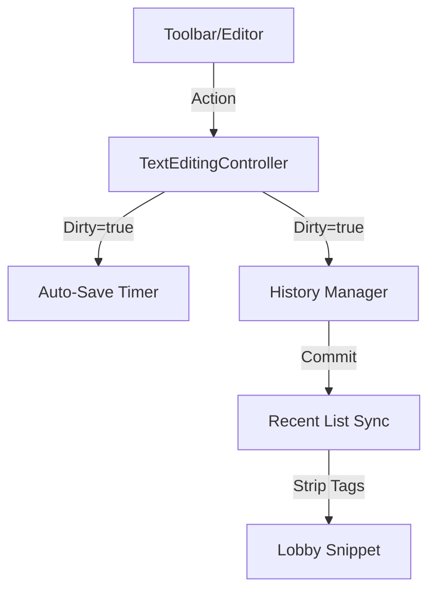

# Styling Technical Map (Planning Phase)

This document maps out the technical components and their interactions to prevent collisions during the styling engine hardening.

## 1. The Styling Service (`styling_service.dart`)

This will be the source of truth for all text transformations.

| Method | Purpose | Implementation Strategy |
| :--- | :--- | :--- |
| `stripTags` | Leak Prevention | `text.replaceAll(RegExp(r'\[.*?\]|\*\*'), '')` |
| `applyAlignment` | Professional Layout | Regex purge of `[center/left/right/rtl/ltr]` tags + wrapping. |
| `wrapStyle` | Text Suite | Detect nested tags, toggle existing tags, handle auto-word selection. |
| `cleanScript` | Reset logic | Global sweep of all controllers to remove all markup. |

## 2. History & Bulking Registry

To prevent "History Pollution," we will manage states as follows:

- **Type 1: Micro-Edits (Typing)**
  - Logic: 10 chars / 10s debounced commit.
  - Trigger: `TextEditingController.addListener`.
- **Type 2: Global Commands (Clear All)**
  - Logic: Immediate commit.
  - Snapshot: Full script state.
- **Type 3: Suite Sessions (Modal Edits)**
  - Logic: Open -> Save base snapshot -> Capture edits (dirty flag) -> Close -> Commit 1 entry if dirty.
  - Trigger: `_activeSuite` state change.

## 3. Propagation & Sync (The "Dirty" Path)

## 4. Collision Prevention (Specific Guards)

1.  **Selection Guard**: Always check `_lastSelection` if current `controller.selection` is invalid (common when clicking toolbar buttons).
2.  **Global Selection Guard**: When `Ctrl+A` is active (Global Mode), styling actions apply to ALL paragraphs and then clear the global flag.
3.  **Inheritance Guard**: When starting to type after a styled word, the `_MarkupController` should continue the style (this is handled by the markup regex rendering, but we need to ensure the `cursorStyleProvider` stays in sync).
